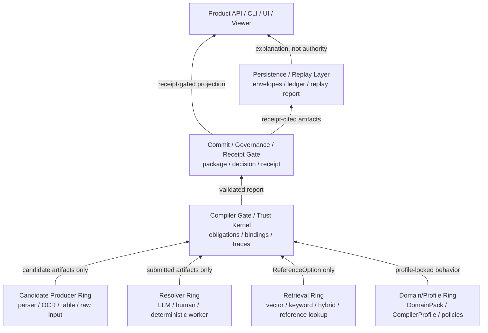
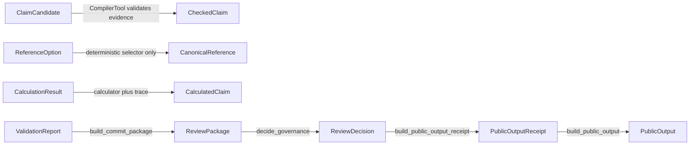

# Trust Kernel Extension Rings

Status: active-contract
Owner: trust-kernel
Last checked against code: 2026-05-22
Can block PRs: yes

This document names the outer shape of the `comp` rebuild. The core is a small
trust kernel. Domain logic, retrieval, LLM workers, parsers, persistence
backends, APIs, CLIs, and UIs attach around it as extension rings.

The point of the model is not layering for its own sake. It is to preserve one
authority rule:

```text
Outer rings may propose artifacts or render views.
Only deterministic gates inside the kernel may promote authority.
```

Public rows are receipt-replayable views. They are never authority by
themselves.

## Thesis

`comp` does not create truth. It compiles the conditions under which a value can
be claimed, records how those conditions were satisfied, and gates public
projection through a `PublicOutputReceipt`.

New capabilities should therefore be judged by whether they keep this authority
chain legible:

```text
candidate / resolver artifact
-> deterministic gate
-> canonical binding or open obligation
-> calculation trace
-> commit package
-> governance decision
-> commit receipt
-> receipt-gated projection
```

## Extension Rings

The rings describe module ownership and integration direction. Authority
increases toward the center and upward through the receipt gate.



### Candidate Producer Ring

Extractors, Lark parsers, table parsers, OCR, CSV readers, PDF readers, and raw
input adapters live here.

They may produce evidence and candidate artifacts such as:

```text
EvidenceRef
ClaimCandidate
ReadingCandidate
ParseDerivation
TableCellCandidate
AmbiguitySet
```

They must not produce checked claims, reference bindings, derived claims, commit
receipts, or public projections.

### Resolver And Retrieval Rings

LLM workers, human reviewers, deterministic fixture resolvers, retrieval
bridges, and future search backends live outside the compiler gate.

Resolver output is submitted artifact, not state mutation. A resolver may submit
objects such as:

```text
SemanticJudgment
ReferenceQuery
EvidenceLink
ContextAttachment
AbstentionArtifact
HumanReviewQuestion
ConflictFlag
```

Retrieval is a special resolver path with one narrow output shape:

```text
ReferenceQuery -> ReferenceOption[]
```

`ReferenceOption` remains candidate-only regardless of retrieval score or
backend. The deterministic selector is the only path to `CanonicalReference`.

### Domain/Profile Ring

Core code owns protocol, not domain meaning. Domain packs, compiler profiles,
reference packs, fixtures, or external reference resources own domain behavior:

```text
kWh
Scope 2
PCF
market-based
supplier-specific factor
reporting_year
projection fields
factor compatibility
```

`CompilerProfile` is the behavior lock. Installed domain packs are not active
until the profile activates their rules, rubrics, judge policy, retrieval
policies, or projection policy. Receipts should preserve the profile behavior
identity through deterministic dependency fingerprints.

The consolidated review contract for this ring lives in
`compiler-domain-boundary.md`.

### Compiler Gate / Trust Kernel

The compiler gate is intentionally small. It validates submitted artifacts and
performs authority promotion:

```text
ClaimCandidate validation
EvidenceRef checking
ValidationRequirement generation
SemanticJudgment protocol validation
ReferenceOption -> CanonicalReference deterministic selection
CalculationRequirement handling
CalculationTrace / CalculatedClaim creation
ValidationReport status recomputation
```

It should not parse raw input, call real LLM providers, search vector databases,
render UI, persist durable storage, or hard-code ESG meaning.

### Commit / Governance / Receipt Gate

This ring is the public authority boundary:

```text
ValidationReport
-> ReviewPackage
-> ReviewDecision
-> PublicOutputReceipt
```

`ReviewPackage` and `ReviewDecision` may explain why a projection is close
to publishable. They do not authorize projection. `PublicOutputReceipt` is the public
projection authority.

### Persistence / Replay Layer

Persistence records the substrate needed to replay a receipt-authorized view:

```text
ArtifactEnvelope = replay substrate
PublicOutputReceipt = ledger root
stored public row = cached view
ProjectionReplayReport = explanation artifact
```

Replay reports explain a receipt path. They do not become authority.

### Product API / CLI / UI / Viewer

The product shell renders and routes. It may display evidence, obligations,
candidates, receipts, public rows, and replay reports. It must not decide commit
status from UI state, directly project public rows, or treat viewer JSON as
authority.

## Authority Promotion DAG

The rings describe ownership. The DAG describes the promotion paths that must
not be bypassed.



Only the named deterministic gates may perform these promotions. Parsers,
retrievers, LLM workers, humans, persistence backends, and UIs may provide
inputs to the gates, but they do not own the promotion.

## Extension Ports

Ports should keep backend expansion from changing authority semantics.
The detailed contracts live in `extension-port-contracts.md`.

Recommended port shapes:

```python
class ExtractorPort(Protocol):
    def extract(self, source_unit: SourceUnit) -> tuple[CandidateArtifact, ...]:
        ...


class ResolverWorker(Protocol):
    def run(self, work_order: WorkOrder) -> WorkerResult:
        ...


class ReferenceResolver(Protocol):
    def search(
        self,
        query: ReferenceQuery,
        *,
        limit: int = 10,
    ) -> tuple[ReferenceOption, ...]:
        ...


class ArtifactStore(Protocol):
    def record(self, envelope: ArtifactEnvelope) -> ArtifactEnvelope:
        ...

    def get(self, artifact_id: str) -> ArtifactEnvelope:
        ...


class ReceiptLedger(Protocol):
    def record(self, receipt: PublicOutputReceipt) -> PublicOutputReceipt:
        ...

    def get(self, key: ReceiptLedgerKey) -> PublicOutputReceipt:
        ...
```

The first implementations can remain dataclass fixtures and in-memory stores.
The important constraint is that future real backends implement these ports
without gaining authority.

## Package Boundaries

Package names can evolve slowly. Import direction matters more:

```text
comp must not import minchoagnt
minchoagnt may use comp
persistence may depend on judgment receipts
compiler_tool should not depend on a durable persistence backend
scenario tests are fixture verdicts, not production authority
```

Avoid namespace-wide relocation unless a boundary is already clear. If a module
moves, first answer which authority it currently holds, whether that authority
belongs there, and which layer should own it.

### Machine-Checked Import Boundaries

Authority modules cannot import presentation, display, or explanation modules.
This is checked by `tests/test_authority_import_boundaries.py`.
The compiler/domain import boundary is consolidated in
`compiler-domain-boundary.md`.

```text
comp.judgment must not import comp.compiler_tool
comp.judgment must not import comp.persistence
comp.judgment must not import comp.explanation
comp.judgment must not import comp.views
comp.judgment must not import comp.schema_labels
comp.judgment must not import comp.user_messages
comp.judgment must not import comp.scenario_contracts
comp.judgment must not import comp.scenarios
comp.judgment must not import comp.domains
comp.judgment must not import comp.products
comp.judgment must not import comp.adapters
comp.judgment must not import comp.runtime

comp.compiler_tool must not import comp.persistence
comp.compiler_tool must not import comp.explanation
comp.compiler_tool must not import comp.views
comp.compiler_tool must not import comp.schema_labels
comp.compiler_tool must not import comp.user_messages
comp.compiler_tool must not import comp.scenario_contracts
comp.compiler_tool must not import comp.scenarios
comp.compiler_tool must not import comp.domains
comp.compiler_tool must not import comp.products
comp.compiler_tool must not import comp.adapters
comp.compiler_tool must not import comp.runtime

comp.persistence must not import comp.compiler_tool
comp.persistence must not import comp.explanation
comp.persistence must not import comp.views
comp.persistence must not import comp.schema_labels
comp.persistence must not import comp.user_messages

comp.views.receipt_graph must remain render-only
```

The proof graph exporter may read receipt, replay-report, and artifact-store
types, but it must not call replay or public-output authorization. Renderers may
format existing graph payloads, but they must not export graphs, replay
projections, or authorize public rows.

## Review Rules

Use these rules when reviewing PRs:

```text
Authority promotion happens only in deterministic gates.
External output enters as submitted, candidate, proposed, non-authoritative data.
Profile-active behavior is explicit and fingerprinted.
Retrieval score never selects truth.
Public output requires a clean PublicOutputReceipt.
Stored public rows must be replayable from receipt-cited artifacts.
Replay reports explain authority; they do not become authority.
Product UI renders the authority path; it does not create it.
```

## Phased Use

This frame gives the long-term shape. The current implementation should advance
in small slices:

```text
1. Harden the trust kernel and profile fingerprints.
2. Add typed obligation factories before large obligation refactors.
3. Add artifact envelope builders for report and commit artifacts.
4. Introduce real persistence, retrieval, parser, and LLM backends through ports.
5. Build a thin product shell only after receipt replay remains stable.
```
