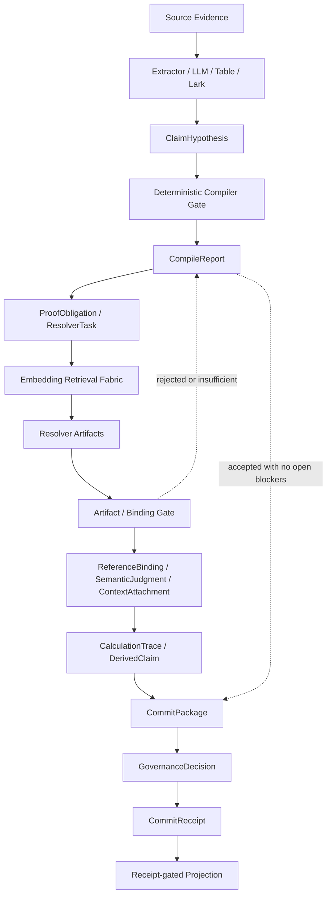
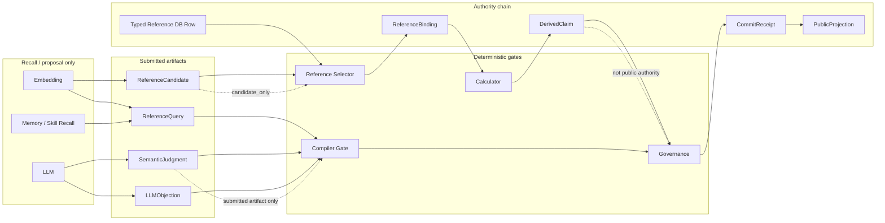
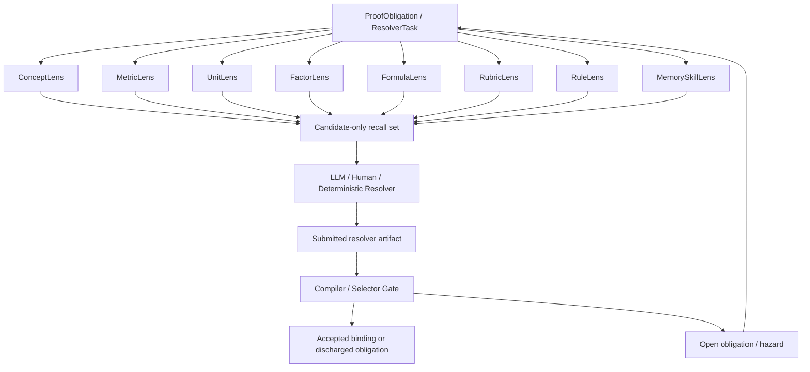

# Retrieval Fabric North Star

This document fixes the long-term direction for retrieval, LLM resolution,
typed reference authority, compiler gates, and receipt-gated projection.

It is a north-star document, not an implementation design. The purpose is to
make future retrieval and embedding work easy to judge before code is added.

## Core Formula

```text
Embedding = reference / memory / rule candidate recall fabric
LLM = resolver artifact proposer
Compiler = artifact and binding gate
DB = typed canonical reference authority
Receipt = public projection authority
```

The intended system is:

```text
Curated ESG Reference DB
+ Embedding Retrieval Fabric
+ LLM Artifact Resolver
+ Deterministic Compiler Gate
+ Judgment / Governance / Receipt
```

The short version:

```text
Embedding recalls candidates.
LLM submits resolver artifacts.
Compiler decides whether submitted artifacts discharge obligations.
DB rows and deterministic bindings carry canonical authority.
Receipt authorizes public projection.
```

## Architecture Diagrams

These diagrams are orientation maps. They do not define new implementation
contracts.

### North Star Flow



### Authority Boundary Map



### Retrieval Lens Map



## Authority Boundaries

The first invariant is that recall is not authority:

```text
Embedding / LLM -> candidate or submitted artifact only
ReferenceCandidate != ReferenceBinding
DerivedClaim != public output
CommitReceipt == public projection authority
```

An embedding result must remain candidate-only, even when it is top-ranked.
A vector similarity score is a retrieval hint, not a truth score.

An LLM does not resolve obligations by declaration. It submits resolver artifacts
for obligations, such as:

```text
ClaimHypothesis
ReferenceQuery
SemanticJudgment
EvidenceLink
ContextAttachment
RuleProposal
ReviewQuestion
LLMObjection
```

The compiler decides whether those artifacts satisfy the active profile,
obligation protocol, rubric, judge policy, reference criteria, and core
invariants.

LLM and embedding results must not directly create:

```text
ReferenceBinding
DerivedClaim
GovernanceDecision
CommitReceipt
PublicProjection
Core invariant changes
```

## Obligation-Indexed Retrieval

This north star is an obligation-indexed retrieval fabric over typed reference,
rule, rubric, memory, and skill sources.

Retrieval should usually begin from an obligation or resolver task, not from a
free-form claim alone.

```text
ProofObligation / ResolverTask
-> choose retrieval lens
-> recall candidates
-> submit resolver artifact
-> compiler gate
```

This makes retrieval a way to pay down explicit compiler obligations, not a
general RAG shortcut.

Examples:

```text
find_source_witness(unit)
-> UnitLens / TableHeaderSkillLens / MemorySkillLens
-> evidence or context candidates

reference_search_required(emission_factor)
-> FactorLens / FormulaLens / ConceptLens
-> ReferenceCandidate artifacts

missing_rule_coverage(factor_period_compatibility)
-> RuleLens / RubricLens / DomainPackLens
-> RuleProposal or profile coverage candidate
```

The retrieval layer may widen what the resolver sees. It does not lower the
compiler gate.

## Retrieval Lenses

The retrieval fabric should be split into lenses instead of one undifferentiated
vector index.

```text
ConceptLens
  taxonomy concept candidates

MetricLens
  metric definition candidates

UnitLens
  unit and unit alias candidates

FactorLens
  emission factor candidates

FormulaLens
  calculation formula candidates

RubricLens
  semantic judgment rubric candidates

RuleLens
  rule family and obligation template candidates

MemorySkillLens
  minchoagnt memory and skill candidates
```

The same phrase can be meaningful in several lenses. For example,
`supplier-specific emission factors` may be a factor candidate, a Scope 2 method
signal, a rubric candidate, or a rule coverage signal. Lens separation keeps the
retrieval intent explicit.

## Candidate-Only Retrieval Result

Retrieval outputs should look like candidate artifacts:

```text
ReferenceCandidate:
  candidate_id
  reference_id
  reference_type
  retrieval_method
  retrieval_score
  authority = candidate_only
```

Candidate artifacts may come from keyword search, alias lookup, embedding,
memory recall, or rule/rubric lookup. The source can differ, but the authority
stays candidate-only.

The next gate is deterministic selection:

```text
ReferenceCandidateSet
-> reference_type check
-> catalog row exists
-> unit / period / geography / method / source compatibility
-> required witness checks
-> conflict / ambiguity checks
-> ReferenceBinding or blocking obligation
```

`ReferenceBinding` is the point where a candidate becomes usable for
calculation. It should cite the selected candidate, selector rule, witnesses,
and rejected candidates.

## Negative Retrieval And Near Misses

Retrieval should keep useful near misses, not only likely positives.

Near misses make selector behavior auditable:

```text
KR_GRID_2024_LOCATION
SUPPLIER_SPECIFIC_FACTOR
RESIDUAL_MIX_2024
```

The selector can reject close but wrong candidates with reasons:

```text
supplier_specific_factor -> missing supplier-specific factor source
residual_mix_2024 -> method_mismatch
kr_grid_2023 -> period_mismatch
```

This helps answer audit questions:

```text
Why was this factor considered?
Why was it rejected?
Why did the final binding use a different reference?
```

## Profile Coverage Retrieval

Retrieval should also help detect missing profile coverage.

If the compiler reports an unchecked area or missing rule coverage, retrieval
can search rule, rubric, and domain-pack lenses:

```text
UncheckedArea: factor_period_compatibility
-> RuleLens finds ghg.factor_period_compatibility.v1
-> RubricLens finds related semantic rubric
-> profile coverage gap candidate
```

Finding a rule or rubric does not activate it. Activation remains a profile and
governance decision. Retrieval only exposes that a plausible missing capability
exists.

## Future Directions

Two larger structures are likely useful later, but they are not part of the next
implementation slice.

### Retrieval Staging Area

A staging area can hold mixed recall results before they are submitted to the
compiler:

```text
reference_candidates
rubric_candidates
rule_candidates
formula_candidates
memory_candidates
skill_candidates
objections
proposed_queries
```

The staging area is not authority. It is resolver context and audit material.

### Candidate Graph

A candidate graph can preserve why candidates appeared, how they were rejected,
and which artifacts eventually reached receipt:

```text
EvidenceSpan
ClaimHypothesis
ReferenceCandidate
ReferenceBinding
SemanticRubric
RuleFamily
SemanticJudgment
DerivedClaim
ProofObligation
LLMObjection
```

Possible edges:

```text
retrieved_by_embedding
matched_alias
requires_semantic_judgment
rejected_by_selector
bound_by_rule
used_in_calculation
discharged_by_judgment
cited_by_receipt
```

This is useful for audit and debugging, but it should not be implemented before
the candidate-only retrieval path is stable.

## Near-Term Implementation Slices

The first code slice should stay small:

```text
feat: add retrieval lens interface and embedding resolver stub
```

It should add only the contract needed for embedding-style retrieval to enter
the system safely:

```text
ReferenceQuery
ReferenceIndexEntry
ReferenceResolver protocol
EmbeddingResolverStub
candidate-only invariant tests
```

The bridge slice is also intentionally narrow:

```text
feat: add retrieval resolver bridge
```

It connects an open retrieval obligation to the resolver interface without
creating authority:

```text
ProofObligation(kind="reference_search_required")
-> ReferenceQuery
-> ReferenceResolver.search(...)
-> ReferenceCandidate[]
-> CompileReport.reference_candidates
```

The bridge may discharge the search obligation, but it must not create:

```text
ReferenceBinding
DerivedClaim
GovernanceDecision
CommitReceipt
PublicProjection
```

Those remain separate deterministic gates.

Retrieval query policies should be active only when pinned by the compiler
profile:

```text
DomainPack declares RetrievalQueryPolicy
CompilerProfile.active_retrieval_policy_ids locks the active set and order
Profile-aware query builder turns ResolverTask into ReferenceQuery
Inactive or unknown policy ids do not run
```

Once the bridge exists, the canonical raw-input scenario should use it as the
standard path:

```text
raw evidence
-> deterministic extractor stub
-> CompilerTool
-> calculation_blocked
-> reference_search_required
-> ResolverTask
-> profile-active RetrievalQueryPolicy
-> ReferenceQuery
-> retrieval bridge
-> candidate-only ReferenceCandidate
-> deterministic ReferenceBinding
-> calculation retry
-> CommitReceipt
-> receipt-gated projection
```

These slices should not add:

```text
real embedding providers
vector DB dependency
large ESG DB ingestion
automatic factor binding
LLM provider calls
candidate graph implementation
retrieval staging implementation
```

The goal is to create the authority boundary and data path first. Real recall
quality can come later.

## Relationship To Working Theory

`obligation-kernel-working-theory.md` remains the detailed working theory for
the current implementation slice: obligations, semantic judgments,
reference-grounded calculation, commit packages, governance decisions, and
receipts.

This document is the north star for future retrieval work. Use it to decide
whether a proposed embedding, memory, rule, or LLM feature respects the kernel
authority boundaries.
